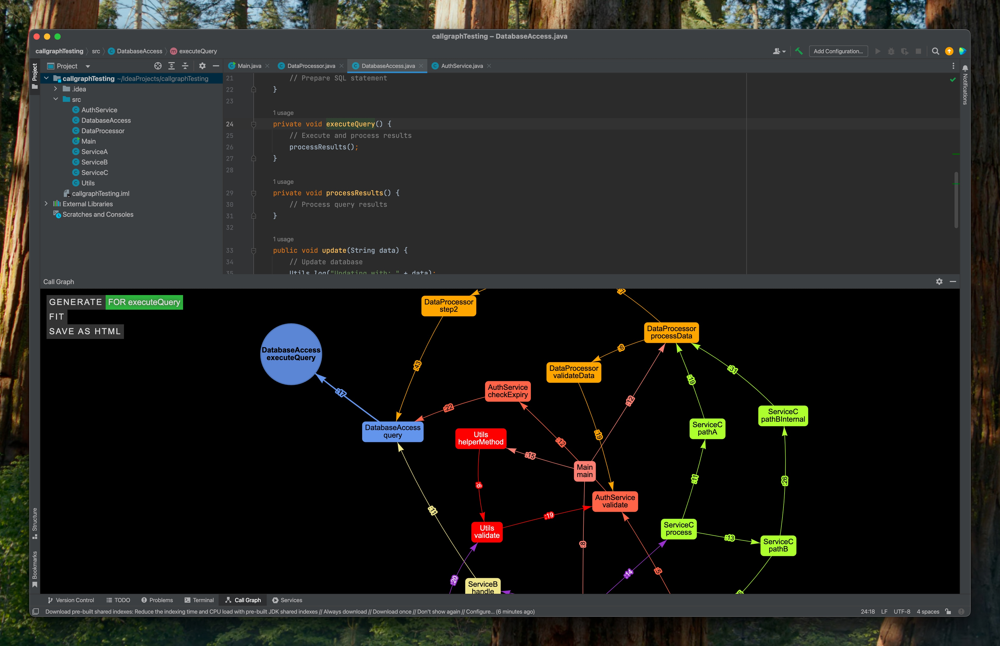

# CallGraph - IntelliJ Plugin

<p align="center">
  
  <br>
  <b>CallGraph</b>
  <br><br>
  <a href="https://plugins.jetbrains.com/plugin/27227-callgraph">
    
  </a>
</p>

## Overview

CallGraph helps you understand your Java codebase by visualizing how methods call each other. Simply select any method, generate a graph, and explore the connections through an interactive diagram. When you click on edges in the graph, you'll be taken directly to where that method call appears in your code editor.



## Usage

1. Place your caret (text cursor) on any Java method in your code
2. Either:
   - Right-click and select "Generate Call Graph" from the context menu
   - Use keyboard shortcut Alt+Shift+E (Option+Shift+E on macOS)
   - Click on the CallGraph icon in the toolbar (or use View → Tool Windows → CallGraph) and click the **GENERATE** button
3. Click on any node (method) in the graph to jump to its definition
4. Click on any edge (arrow) in the graph to jump to the exact line where that method is being called

## Features

- You can generate call graphs for any method in your codebase
- You can generate graphs directly from the editor context menu (right-click) or using Alt+Shift+E (Option+Shift+E on macOS) shortcut
- You can navigate to method definitions by clicking nodes in the graph
- You can navigate to exact method call locations by clicking edges in the graph
- You can pan & zoom in and out of the graph
- You can save the graph as a HTML file
- You can customize graph appearance with options like background color

## Requirements

- IntelliJ IDEA (Community or Ultimate) 2022.1 or later
- Java 8 or higher
- Java projects only (requires the Java module)

## Installation

You can install CallGraph in several ways:

### From JetBrains Marketplace

<p align="center">
   <a href="https://plugins.jetbrains.com/plugin/27227-callgraph">
      
   </a>
</p>

1. Click the button above

### Manual Installation

1. Download the latest release from the [Releases page](https://github.com/yunusemregul/callgraph/releases)
2. Open IntelliJ IDEA
3. Go to Settings (Preferences) → Plugins
4. Click the gear icon and select "Install Plugin from Disk..."
5. Select the downloaded ZIP file
6. Restart IntelliJ IDEA when prompted

## Architecture

The plugin consists of two main components:

### Backend (Java)

- Analyzes Java code to extract method call relationships
- Uses IntelliJ Platform APIs to track editor activity and method references
- Processes the call hierarchy data and exposes it to the frontend

### Frontend (JavaScript)

- Built with vis-network.js for interactive graph visualizations
- Provides a responsive UI for graph navigation and exploration
- Communicates with the Java backend through a JavaScript bridge

# Development

For development, you'll need:

- JDK 17+
- Node.js v18.10.0 (or later) and npm
- IntelliJ IDEA

**Quick Start:** The easiest way to run the project is to open it in IntelliJ IDEA and run the "Run Plugin" configuration.

## Manual Build Steps

### Backend

1. Clone this repository
2. Open the project in IntelliJ IDEA
3. Use Gradle to build the plugin:
   ```
   ./gradlew buildPlugin
   ```
4. The plugin ZIP file will be generated in `build/distributions/`

### Frontend

The frontend uses webpack to bundle JavaScript and HTML files.

1. Navigate to the frontend directory:
   ```
   cd src/main/frontend
   ```

2. Install dependencies:
   ```
   npm install
   ```

3. Build the frontend assets:
   ```
   npx webpack
   ```

This will generate the bundled files in `src/main/resources/build/`, which are then included in the plugin.

## Contributing

Contributions are welcome! If you'd like to contribute, please:

1. Fork the repository
2. Create a feature branch
3. Make your changes
4. Submit a pull request

## Version History

### 1.3
- Added options menu for customizing graph background color
- Fixed crash when opening new projects with CallGraph window open
- Fixed multi-project support to respect active editor context
- Added right-click context menu option to generate call graphs
- Added keyboard shortcut (Alt+Shift+E) for quick graph generation

### 1.1 & 1.2
- Improved plugin description for better clarity

### 1.0
- Initial release
- Interactive call graph visualization
- Support for Java projects
- Spring controller endpoint detection

## License

This project is licensed under [LICENSE](LICENSE) - see the LICENSE file for details.